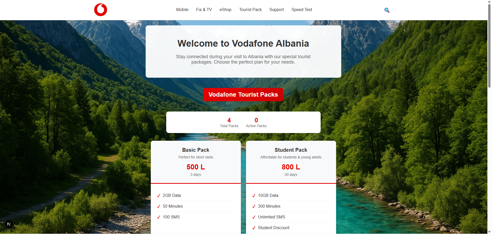
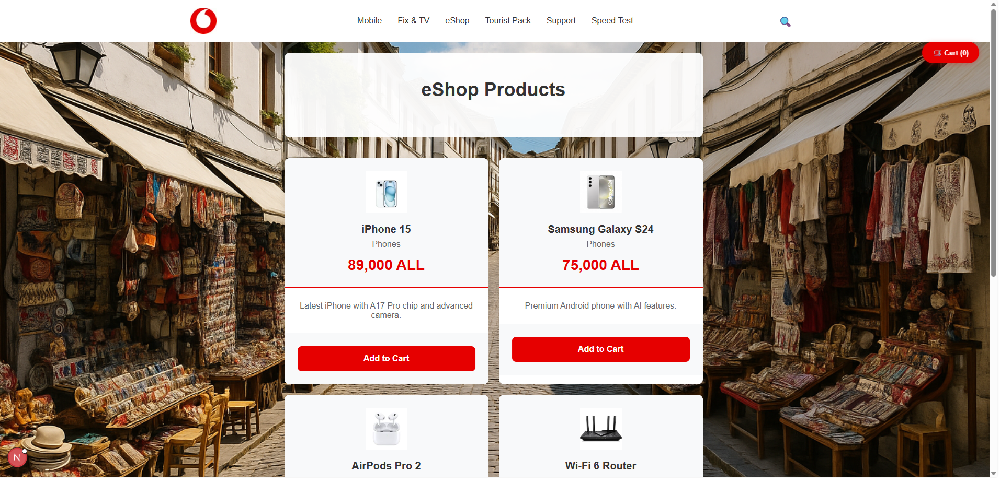
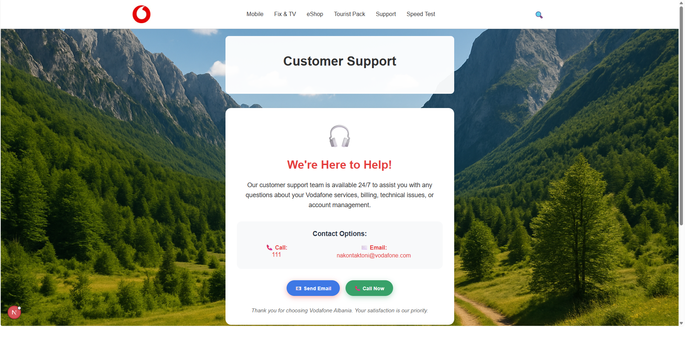

# Preview Vodafone Tourist Pack Website
<p align="center">
  
  
  
</p>

---

## Features

- Tourist Pack page (background image, hero, package cards, Activate modal)
- Fix & TV page (3 bundles, active state)
- Back to Top button
- Responsive layout (mobile friendly)

---

## Tech Stack

| Layer    | Technology                                    |
|----------|-----------------------------------------------|
| Frontend | Next.js 15, React 19, TypeScript, Tailwind CSS |
| Backend  | Java 17, Spring Boot, REST API                |
| Database | PostgreSQL (Docker)                           |

---

## How to Run Locally

Follow these steps **in order**:

### 1. Start the Database (Docker)

> Make sure Docker Desktop is running first.

```bash
cd backend
docker-compose up -d
```

This starts PostgreSQL on `localhost:5332`.

---

### 2. Start the Backend (Spring Boot)

```bash
cd backend
.\mvnw spring-boot:run
```

Wait until you see `Started VodafoneWeb1Application` in the logs.
Backend runs at: **http://localhost:8080**

---

### 3. Start the Frontend (Next.js)

Open a **new terminal** in the project root:

```bash
npm install
npm run dev
```

Frontend runs at: **http://localhost:3000**

---

## Running Services Summary

| Service               | URL                        |
|-----------------------|----------------------------|
| PostgreSQL (Docker)   | localhost:5332             |
| Spring Boot API       | http://localhost:8080      |
| Next.js Frontend      | http://localhost:3000      |

---

## License

This repo is public for portfolio viewing only. See [LICENSE](License).
